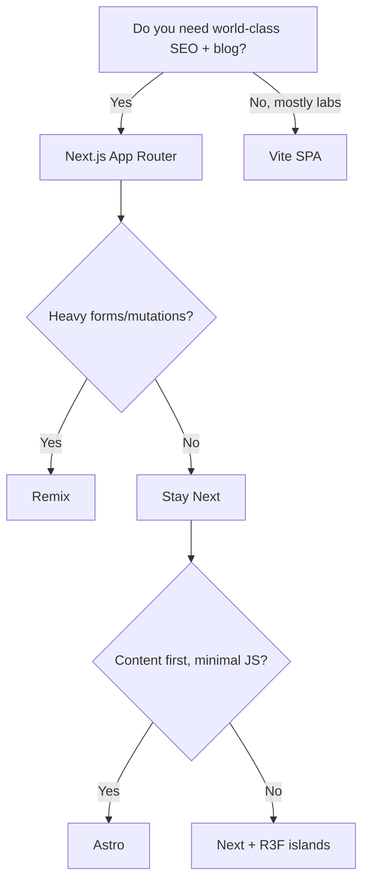

# React Website — System Architecture & Blueprints

> A pragmatic, future‑proof architecture for an interactive personal site with R3F/Three.js (WebGPU+TSL), a blog/notes system, experiments, and an admin/content pipeline.

---

## 0) Goals & Non‑Goals

**Goals**
- Fast, stable, maintainable; editor‑friendly content; delightful 3D/interactive sections.
- Works offline-ish for content (Git‑based MDX) and scales to headless CMS if needed.
- Clean separation of concerns; typed, testable; CI/CD with guardrails.

**Non‑Goals**
- Building a custom CMS from scratch.
- Lock‑in to a single host—prefer portable choices (Vercel/Netlify/Cloudflare OK).

---

## 1) High‑Level Architecture

```
Presentation (React + Next.js App Router)
  ├─ UI library (shadcn/ui + Tailwind + design tokens)
  ├─ 3D layer (R3F + three r180; WebGPU+TSL with GL fallback)
  ├─ Pages/Routes (static + dynamic, i18n-ready)
State & Domain
  ├─ Local state (Zustand/Jotai) + React Query for server/cache
  ├─ Feature services (content, portfolio, labs, music, PHI)
Data & APIs
  ├─ Content system (MDX in repo) or Headless CMS (Sanity/Contentful) adapter
  ├─ API routes (tRPC or REST) for forms/search/AI tools
  ├─ DB (Postgres via Prisma/Drizzle) — optional, only if needed
Infrastructure
  ├─ Storage/CDN (images, KTX2, GLTFs, HDRIs)
  ├─ CI/CD (GitHub Actions) + Analytics + Monitoring
Security, Perf, A11y
  ├─ CSP, MDX sanitization, rate limiting, a11y, SEO
```

---

## 2) Monorepo Layout (pnpm + Turborepo)

```
/ (repo)
├─ apps/
│  ├─ web/                # Next.js app (public site)
│  └─ admin/              # Admin tools or studio (optional)
├─ packages/
│  ├─ ui/                 # shadcn/ui wrappers, tokens, icons
│  ├─ three-kit/          # R3F helpers, materials, loaders, hooks
│  ├─ content/            # MDX content source + schemas + transformers
│  ├─ config/             # eslint, prettier, ts, stylelint shared cfg
│  └─ utils/              # cross-cut helpers (zod, date, number, etc.)
├─ .github/workflows/     # CI (lint, typecheck, test, build, deploy)
├─ turbo.json
├─ pnpm-workspace.yaml
└─ package.json
```

**Why**: Encapsulation, reuse, and fast builds with caching.

---

## 3) Next.js App (apps/web) Structure

```
apps/web/
├─ app/
│  ├─ (site)/             # Marketing + content routes (RSC)
│  │  ├─ layout.tsx
│  │  ├─ page.tsx         # Home (hero + 3D preview)
│  │  ├─ about/
│  │  ├─ portfolio/       # projects with filters
│  │  ├─ labs/            # experiments gallery (3D, WebGPU, demos)
│  │  ├─ music/           # audio-reactive demos
│  │  ├─ phi/             # robot dog section
│  │  ├─ blog/            # MDX index
│  │  │  └─ [slug]/page.tsx
│  │  ├─ notes/           # short posts/snippets
│  │  ├─ now/
│  │  ├─ contact/
│  │  └─ sitemap.xml/route.ts
│  ├─ (3d)/               # Client-only route group for R3F scenes
│  │  ├─ layout.tsx
│  │  ├─ blob-lab/        # full-screen canvas playground
│  │  └─ visualizer/
│  ├─ api/                # server routes (RSC-compatible handlers)
│  │  ├─ search/route.ts
│  │  ├─ contact/route.ts
│  │  └─ embed/route.ts   # vector embeddings for site content
│  ├─ globals.css
│  └─ providers.tsx       # Theme, QueryClient, etc.
├─ components/
│  ├─ ui/                 # re-export shadcn/ui + custom primitives
│  ├─ layout/
│  ├─ content/            # MDX components (Callout, Code, Image)
│  ├─ 3d/                 # Canvas, Lights, Controls, Materials
│  ├─ charts/
│  └─ forms/
├─ lib/
│  ├─ config.ts           # site meta, paths, toggles
│  ├─ mdx.ts              # mdx compiler config (remark/rehype)
│  ├─ seo.ts              # open-graph, canonical, json-ld
│  ├─ search.ts           # pagefind/typesense client
│  ├─ ai.ts               # embed + retrieval helpers
│  └─ csp.ts              # Content Security Policy builder
├─ content/               # co-located MDX (if Git-based)
│  ├─ blog/2025-10-15-r3f-webgpu.mdx
│  ├─ notes/2025-10-10-til.mdx
│  └─ portfolio/project-slug.mdx
├─ public/
│  ├─ media/ (images, videos)
│  ├─ 3d/    (gltf, ktx2, hdr)
│  └─ fonts/
└─ next.config.js
```

**R3F Routes**: Use `dynamic(() => import('...'), { ssr: false })` for `<Canvas/>` pages; keep heavy 3D under `(3d)` group to avoid server bloat.

---

## 4) Design System & Styling

- **Tailwind CSS** with CSS variables for tokens (colors, spacing, radii). Export tokens from Figma if used.
- **shadcn/ui** for base components; wrap with project‑specific props.
- **Icon strategy**: lucide-react + custom set; tree‑shaken bundles.
- **Themes**: light/dark via `class` strategy; persist in `localStorage`.
- **Motion**: Framer Motion; respect `prefers-reduced-motion`.

---

## 5) 3D/Interactive Layer (R3F + three r180)

- **Renderer**: WebGPU + TSL where supported; feature‑detect and fall back to WebGL.
- **Packages** (`packages/three-kit`):
  - `CanvasShell` (resize, dpr, fallback overlay)
  - `useGLTF`, `useKTX2`, `useHDRI` preloader hooks
  - Materials: node‑materials collection (PBR variants, toon, matcap)
  - PostFX: composer presets; toggleable via UI
  - **Asset pipeline**: glTF + Draco + KTX2; HDRI (equirect) tools
- **Scene design**: isolate scene graph per page; share common atoms (lights, env)
- **Audio‑reactive**: analyser node → Zustand store → shader uniforms
- **Safety**: guard expensive effects behind `reducedPerf` flag for mobile.

---

## 6) Content System (Two Options)

**A. Git‑based MDX (default)**
- `/content/{blog|notes|portfolio}/**/*.mdx` with frontmatter (zod‑validated).
- Compile with `next-mdx-remote` or RSC‑compatible MDX; rehype‑pretty‑code.
- **Pros**: versioned, PR reviews, portable, no vendor lock.

**B. Headless CMS (switchable)**
- Sanity/Contentful/Strapi via an **adapter layer** in `packages/content`.
- Sync scripts to export/import to MDX if you ever migrate.

**Media**: store in `/public/media` or object storage (R2/S3) behind CDN.

**Search**: start with **Pagefind** (static, privacy‑friendly). Upgrade to Typesense/Algolia if needed.

**Feeds/SEO**: sitemap, RSS/Atom/JSON feeds, OpenGraph and JSON‑LD per post.

---

## 7) Data Layer & APIs

- **Server routes** in `app/api/*` for contact forms, search index, AI embed.
- **tRPC** (or minimal REST) with Zod schemas; React Query for caching.
- **Database (optional)**: Postgres (Neon/Supabase) via Prisma or Drizzle if you add user data, comments, bookmarks, etc.
- **Auth (optional)**: NextAuth (passkeys/OAuth). Otherwise keep static.

---

## 8) Site Sections (IA)

- **Home**: hero + live 3D teaser; recent work/posts.
- **About / Story**: mission, values, timeline.
- **Portfolio / Projects**: filterable grid; MDX case studies.
- **Labs (Experiments)**: R3F/WebGPU sandboxes; performance switches.
- **Music / Visuals**: audio‑reactive demos, track notes.
- **PHI (Robot Dog)**: builds, parts, videos, downloads.
- **Blog**: essays; **Notes**: short TILs; **Prompts** (optional): curated.
- **Now** page; **Changelog** (site updates); **Contact/Booking**.

---

## 9) Admin & Editorial Workflow

- **Branching**: `main` (prod), `dev` (staging), feature branches per post/feature.
- **Content PR** template (title, summary, tags, cover, check‑list).
- **Preview**: deploy previews per PR; link checks, reading‑time, a11y report.
- **Optional Admin app**: simple MDX editor + asset upload (local‑only) or Decap CMS.

---

## 10) Build & Release Pipeline

**CI (GitHub Actions)**
- Jobs: `lint` → `typecheck` → `test` → `build` → `e2e` (playwright) → `deploy`.
- Cache pnpm/turbo; upload build artifacts; fail on size regression.

**CD**
- Host on Vercel/Netlify/Cloudflare. Use ISR for blog, hard‑cache 3D assets.

**Performance Budgets**
- LCP < 2.5s, CLS < 0.1, TTI < 3.5s, JS < 180KB on content pages.
- Code‑split R3F routes; lazy‑load shaders, post‑FX.

---

## 11) Testing Strategy

- **Unit**: Vitest + RTL for components; ts‑prune in CI.
- **Integration**: Playwright flows (nav, search, contact, MDX render).
- **Visual**: Playwright screenshot diffs for key pages + R3F scenes.
- **Accessibility**: axe checks in CI; keyboard‑only nav tests.

---

## 12) Performance & Assets

- Preload critical fonts; use `next/font` (subset).
- Images: AVIF/WebP with `next/image`; responsive sizes.
- 3D: KTX2 for textures; Draco/meshopt for geometry; route‑level prefetch.
- Edge cache headers; `stale-while-revalidate` for MDX pages.

---

## 13) Security & Privacy

- Strict **CSP**; disallow inline scripts except hashed for R3F loader.
- Sanitize MDX (rehype-sanitize); encode user input.
- Rate limit API routes; bot/probe shields; Sentry for error reporting.
- Cookie‑less analytics (Plausible) unless deeper metrics are required.

---

## 14) Accessibility & SEO

- Keyboard‑first UX, focus rings, skip‑links, landmark roles.
- `prefers-reduced-motion` fallbacks in 3D and UI.
- Semantic MDX with heading discipline (h1 per page; h2..h4 in content).
- Per‑route `metadata` for OG/Twitter cards; canonical and JSON‑LD.

---

## 15) Analytics & Observability

- Plausible (events for CTA, demo interactions);
- Sentry (frontend) + performance tracing; console error budget in CI.

---

## 16) Configuration & Env

- Typed env via `zod` (fail build on missing keys).
- Feature flags in `lib/config.ts` (e.g., `enableWebGPU`, `enableSearchV2`).

---

## 17) Migration/Scale Options

- Start with Git‑MDX, later flip to Sanity via adapter.
- Add DB only when you truly need dynamic user data.
- Modularize `three-kit`; publish as internal package for reuse across apps.

---

## 18) Developer Experience

- Storybook (MDX + UI primitives + 3D atoms with mock Canvas).
- Changesets for versioning `packages/*`.
- Precommit: eslint, prettier, type-check (tsc --noEmit), knip/ts-prune.

---

## 19) Roadmap (90‑Day)

**Phase 1 — Foundation (Weeks 1‑3)**
- Monorepo + Next.js app scaffold; Tailwind + shadcn; base pages; CI.
- MDX pipeline + sample posts; Pagefind search; sitemap/feeds.

**Phase 2 — 3D Core (Weeks 4‑6)**
- `three-kit` package; CanvasShell; HDRI/KTX2/GLTF pipeline.
- One hero R3F scene + Labs index; performance toggles.

**Phase 3 — Content & Portfolio (Weeks 7‑9)**
- Portfolio schema + filters; project pages; OG automation.
- PHI section; music/visualizer MVP.

**Phase 4 — Polish & Admin (Weeks 10‑12)**
- Playwright e2e + visual tests; a11y pass; Plausible/Sentry.
- Optional admin editor or Decap CMS hookup.

---

## 20) Checklists

**Release‑ready**
- [ ] No console errors; self‑checks pass; 404/500 themed.
- [ ] CWV within budget on mobile.
- [ ] Sitemap/feeds/robots present and valid.
- [ ] CSP, MDX sanitization, rate limiting enabled.

**3D page**
- [ ] WebGPU detected and toggled; WebGL fallback works.
- [ ] KTX2 + Draco assets load under 2s on desktop.
- [ ] Motion‑reduced mode honored; CPU/GPU cap available.

---

## 21) References (implementation hints)

- R3F + Next.js dynamic import for `<Canvas/>`; keep RSC boundaries clean.
- Start with Pagefind for search; upgrade path to Typesense/Algolia.
- For content images in MDX: `next/image` with `mdxComponents.Image` wrapper.
- For GLTF textures: bake in Blender; compress to KTX2 with BasisU; serve via CDN.
- For audio‑reactive demos: standard Web Audio API analyser → uniforms via Zustand.

---

**Conclusion**: This blueprint gives you a scalable, typed, testable foundation. Start Git‑MDX + R3F islands, refine `three-kit`, and keep content workflows PR‑driven. You can grow into CMS/DB later without architectural debt.


---

# Comparative Architectures & Pipelines — In‑Depth Analysis + Rankings

This section complements the blueprint with **high‑ and low‑level comparisons** across the full stack, then ranks options for your use case (interactive React site with heavy R3F/WebGPU and a strong writing/portfolio flow).

## A) Evaluation Criteria (scored 1–5)
- **Perf** (runtime + Core Web Vitals)  
- **DX** (developer experience, tooling, docs)  
- **Flex** (customization, escape hatches)  
- **Scale** (handles growth, features, teams)  
- **SEO** (SSR/SSG/RSC friendliness)  
- **3D‑Fit** (R3F/Three/WebGPU ergonomics)  
- **Lock‑in** (vendor/framework coupling)  
- **Cost** (infra + typical SaaS fees)

> Scores are opinionated and optimized for **solo/lean team building an advanced interactive portfolio + labs**.

---

## B) Core Web App Architectures (React‑centric)

### B1) **Next.js (App Router: RSC + Server Actions)**
**How it works**: Hybrid SSR/SSG/RSC. Server Components fetch on the server, Client Components for interactivity. Edge/runtime options.  
**Strengths**: Full‑stack ergonomics; best‑in‑class SEO; great file routing; massive ecosystem; image/OG tooling; server actions reduce boilerplate.  
**Watch‑outs**: RSC mental model learning curve; implicit caching rules; can feel coupled to Vercel features (though portable).  
**R3F fit**: Excellent as **CSR islands** under `dynamic(() => ..., { ssr:false })`; clean separation for heavy 3D routes.

**Scores**: Perf 5 | DX 4.5 | Flex 4.5 | Scale 5 | SEO 5 | 3D‑Fit 4.5 | Lock‑in 3.5 | Cost 4.5

---

### B2) **Remix (Full‑stack, progressive web)**
**How it works**: Conventional routes with loaders/actions; great forms; streams; strong web standards ethos.  
**Strengths**: Simple mental model; great mutations/forms; solid SSR; runs anywhere (Node/Workers).  
**Watch‑outs**: Less built‑in image/OG niceties; smaller ecosystem for MDX/blog patterns vs Next.  
**R3F fit**: Great—treat 3D views as CSR islands; good control over fetch/mutations.

**Scores**: Perf 4.5 | DX 4.5 | Flex 4.5 | Scale 4.5 | SEO 4.5 | 3D‑Fit 4.5 | Lock‑in 4.5 | Cost 4.5

---

### B3) **Astro (Content‑first + Islands, React support)**
**How it works**: Content pipelines + partial hydration islands (React/R3F components embedded).  
**Strengths**: Blazing content performance; simple MDX; minimal JS by default; great for blogs/docs/marketing.  
**Watch‑outs**: Advanced app features require additional wiring; not “React‑all‑the‑way”.  
**R3F fit**: Very good as **islands** for demos/visualizers; keep majority content static.

**Scores**: Perf 5 | DX 4.5 | Flex 4 | Scale 4 | SEO 5 | 3D‑Fit 4 | Lock‑in 4.5 | Cost 5

---

### B4) **Vite SPA (+ BFF: Fastify/Express/Cloudflare Workers)**
**How it works**: Pure SPA with API/BFF separately; you own everything.  
**Strengths**: Maximum control; smallest runtime surface; ideal for canvas‑heavy labs.  
**Watch‑outs**: SEO needs SSR/Prerender; you must assemble routing, images, OG, etc.  
**R3F fit**: Excellent for labs; pair with `@tanstack/router` and a slim SSR if needed.

**Scores**: Perf 4.5 | DX 4.5 | Flex 5 | Scale 4 | SEO 3 (without SSR) | 3D‑Fit 5 | Lock‑in 5 | Cost 5

---

### B5) **Gatsby (SSG/DSG)**
Pros: mature content/source plugins. Cons: ecosystem momentum shifted; build speed/complexity.  
**Scores**: Perf 4 | DX 3.5 | Flex 3.5 | Scale 4 | SEO 4.5 | 3D‑Fit 3.5 | Lock‑in 3 | Cost 4.5

**TL;DR — Architecture Rank (for you)**:  
1) **Next.js (App Router)**  2) **Remix**  3) **Astro**  4) **Vite+SPA**  5) Gatsby

---

## C) Rendering Strategies

| Strategy | What it is | Best for | Pros | Cons | 3D Notes |
|---|---|---|---|---|---|
| **CSR (SPA)** | Client‑only | labs, dashboards | minimal server cost, maximal control | SEO needs help | Ideal for heavy WebGL/WebGPU |
| **SSR** | render on server per request | SEO, personalization | great SEO; dynamic | server cost; latency | 3D often CSR island anyway |
| **SSG** | build time HTML | blogs, marketing | fastest; cacheable | rebuild to update | pair with CSR for 3D |
| **ISR/ISG** | on‑demand regen | blogs/portfolio | fresh + cached | cache complexity | safe default for content |
| **RSC** | server components | data‑heavy pages | less client JS | new mental model | keep R3F in client islands |
| **Edge SSR** | at CDN edge | global SEO | low latency | platform‑specific | great for marketing pages |

**Pick**: Marketing/blog = SSG/ISR + RSC. Labs/3D = CSR islands.

---

## D) State & Server Sync

**Local/UI State**  
- **Zustand**: tiny, ergonomic, ideal for R3F uniforms/audio stores.  
- **Jotai**: atom‑based granularity; great for canvases.  
- **Redux Toolkit**: enterprise patterns, devtools; heavier.  
- **XState**: statecharts, great for complex flows.

**Server Data**  
- **TanStack Query**: gold standard for fetching/caching; mutations; retry; dedupe.  
- **SWR**: simpler, lighter; less batteries.  
- **tRPC**: typesafe end‑to‑end contracts; pairs with Zod.  
- **GraphQL (Urql/Apollo)**: flexible, but extra surface.

**Rank (your use case)**: Zustand + TanStack Query (top) → Jotai → tRPC → Redux → GraphQL.

---

## E) Content Systems

| Option | Authoring | Preview | Media | Portability | Cost | Notes |
|---|---|---|---|---|---|---|
| **Git‑MDX** | local/PR | deploy previews | /public or S3/R2 | ⭐ highest | $ | Ideal start; versioned |
| **Sanity** | web studio | instant | CDN | high | $$ | flexible, strong queries |
| **Contentful** | web | good | CDN | med | $$$ | polished UI, pricier |
| **Strapi** | self‑host | good | local/S3 | high | $ | control, but ops |
| **Ghost (headless)** | editor‑friendly | good | CDN | med | $$ | blog‑centric |
| **WordPress headless** | familiar | ok | many | med | $‑$$ | plugins galore |

**Rank**: Git‑MDX → Sanity → Strapi → Contentful → Ghost → WP (for you).

---

## F) Search

- **Pagefind**: static, instant, zero‑backend. ⭐ Start here.  
- **Typesense/Meilisearch**: self‑host or managed; typo‑tolerant.  
- **Algolia**: superb relevance/UI; $$.

**Rank**: Pagefind (phase 1) → Typesense (phase 2) → Algolia (when $$ OK).

---

## G) 3D / R3F / WebGPU Pipeline

**Baseline pipeline**
1. Author in Blender → **glTF** (Draco/meshopt) + **KTX2** textures.  
2. Bake lightmaps/normal/roughness in Blender where useful.  
3. HDRIs (equirect .hdr) → compress & host on CDN.  
4. Load via `three-stdlib`/R3F hooks; gate WebGPU+TSL with feature detect; **fallback to WebGL**.  
5. PostFX via composer/Nodes; expose toggles in UI; honor `prefers-reduced-motion`.

**Alternatives**: BabylonJS (great WebGPU), PlayCanvas (engine), but **R3F stays top** for React integration.

**Rank**: R3F + Three (WebGPU+TSL with GL fallback) ≫ Babylon (if not React) ≫ others.

---

## H) Styling & Design System

- **Tailwind + shadcn/ui**: speed, consistency, theming; tree‑shaken. ⭐  
- **CSS Modules**: simple, portable; verbose for design systems.  
- **Vanilla Extract**: typed CSS; great, but more setup.  
- **Emotion/styled‑components**: DX nice; runtime cost; SSR care.

**Rank**: Tailwind+shadcn → CSS Modules → Vanilla Extract → Emotion/styled.

---

## I) Forms & Validation

- **React Hook Form + Zod** ⭐  
- **Formik + Yup**  
- **Server Actions + Zod** (Next)  
- **tRPC input validators**

**Rank**: RHF+Zod → Server Actions+Zod → tRPC → Formik.

---

## J) Testing Stack

- **Vitest + RTL** (unit) ⭐  
- **Playwright** (e2e + visual diffs) ⭐  
- **Storybook** (component/dev docs)  
- **axe + jest‑a11y** (a11y checks)

**Rank**: Vitest/RTL + Playwright (+ Storybook for UI kits).

---

## K) Hosting/CDN & Deployment

| Host | Edge | Images | Functions | Notes |
|---|---|---|---|---|
| **Vercel** | ⭐ | ⭐ | ⭐ | Best with Next; OG/Image, ISR simplicitly |
| **Cloudflare** | ⭐ | good | ⭐ | Workers/Pages; great global latency |
| **Netlify** | good | good | good | solid all‑rounder |
| **Fly.io / Render** | ok | self | ok | more ops control |

**Rank**: Vercel (Next) / Cloudflare (Remix/Astro/SPA) → Netlify → Fly/Render.

---

## L) CI/CD

- **GitHub Actions** ⭐ (cache pnpm + turbo; lint→typecheck→test→build→e2e→deploy).  
- Gate merges on CWV budgets and console‑error budget.

---

## M) Observability & Analytics

- **Plausible** (privacy, light) ⭐  
- **PostHog** (product analytics, sessions)  
- **Sentry** (errors + perf) ⭐

**Rank**: Sentry + Plausible; add PostHog if you need funnels/session replays.

---

## N) Security & Auth

- **CSP** + MDX sanitize + rate limiting (upstash/worker KV).  
- **Auth**: NextAuth (passkeys/OAuth) or **Lucia** (framework‑agnostic).  
- **Secrets**: Zod‑validated env at boot; fail fast.

---

## O) i18n

- **next‑intl** (Next) ⭐  
- **lingui** (lib‑agnostic)  
- **react‑intl** (classic)

---

## P) AI/RAG/Search Extensions (Optional)

- **Embeddings**: OpenAI or local (e5/Instructor)  
- **Vector DB**: **pgvector** (Postgres) ⭐, or **Supabase** Vector; Pinecone/Weaviate if managed.  
- **Pipeline**: MDX → chunk → embed → store → route `/api/ask` → RSC surface.

**Rank**: pgvector (cost/control) → Supabase Vector → Pinecone.

---

## Q) Monorepo Tooling

- **pnpm + Turborepo** ⭐ (fast, simple)  
- **Nx** (more generators, heavier)  
- **Rush** (large orgs)

**Rank**: pnpm+Turbo → Nx → Rush.

---

## R) Recommended Stacks by Scenario

**1) Solo Portfolio + Labs (your case)**  
- **Next.js (App Router)** + **Git‑MDX** + **Pagefind** + **R3F islands**  
- Zustand + TanStack Query; Tailwind+shadcn; Vercel (prod) + Cloudflare cache.  
- Sentry + Plausible; GitHub Actions; pnpm+Turbo.  
**Why**: Best SEO/content + clean 3D separation; lowest ops; grows later.

**2) Content‑First publication + 3D widgets**  
- **Astro** + MDX + Pagefind; embed R3F islands; Cloudflare Pages.  
**Why**: Peak content perf, ultra‑low JS, still showcases 3D.

**3) Full‑stack app with complex mutations**  
- **Remix** + Postgres + tRPC or simple REST; Workers/Edge.  
**Why**: Forms & mutations ergonomics, progressive enhancement.

**4) Labs/Playground only**  
- **Vite SPA** + Fastify BFF; Cloudflare Workers; static marketing via Astro.  
**Why**: Absolute control and minimal friction for WebGPU experiments.

---

## S) Decision Tree (Condensed)



---

## T) Final Rankings (Overall, for **your** goals)

1. **Next.js (App Router) + Git‑MDX + Pagefind + R3F islands**  
   *Best balance of SEO, performance, content ergonomics, and 3D isolation; smooth growth path to CMS/AI/Search.*
2. **Remix full‑stack**  
   *If you foresee complex forms/actions and want maximal platform portability.*
3. **Astro content‑first**  
   *If content performance and simplicity dominate, with 3D as sprinkled islands.*
4. **Vite SPA (+ BFF)**  
   *If the site becomes a pure playground and SEO is secondary.*

> Next step: I can generate a **starter monorepo** (pnpm+Turbo) with the top‑ranked stack, including `apps/web`, `packages/ui`, `packages/three-kit`, MDX content pipeline, Pagefind, Sentry/Plausible, and a ready R3F lab route.

