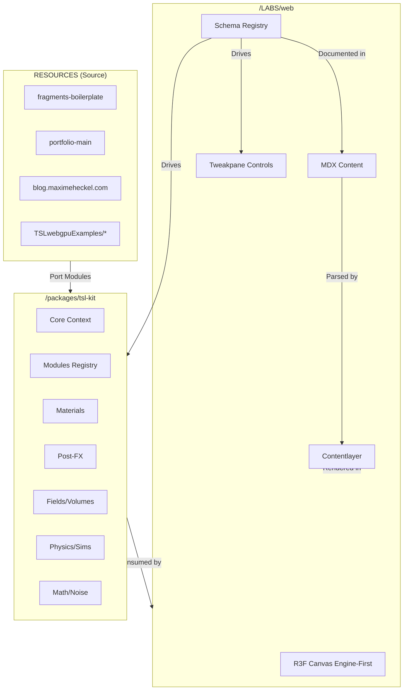

# TSL/WebGPU/MaterialX Engine — Unified Development Proposal

**Version:** 1.0  
**Date:** November 13, 2024  
**Status:** Final Unified Specification

---

## 📋 Table of Contents

1. [Executive Summary](#executive-summary)
2. [Vision & Core Goals](#vision--core-goals)
3. [Technical Architecture](#technical-architecture)
4. [Resource Analysis & Port Strategy](#resource-analysis--port-strategy)
5. [Engine Module Map](#engine-module-map)
6. [Repository Structure](#repository-structure)
7. [LABS & Showcase Website](#labs--showcase-website)
8. [Implementation Roadmap](#implementation-roadmap)
9. [Quality Standards & Testing](#quality-standards--testing)
10. [Risk Assessment & Mitigation](#risk-assessment--mitigation)

---

## Executive Summary

### Project Goal

Build a **self-contained, plug-and-play TSL/WebGPU/MaterialX engine** on **Three.js r181+** that integrates with an **engine-first website** featuring:

- **Out-of-the-box ready**: Drop into any Three.js/WebGPU project with advanced visuals immediately
- **Modular & composable**: Components work independently and snap together
- **Production-ready**: Pre-built modules for materials, lighting, post-FX, physics, sims
- **Agent-friendly**: Clear APIs and JSON schemas for AI/coding agents
- **Rapid prototyping**: One-liner helpers and example scenes
- **Schema-driven**: Single source controls engine, Tweakpane UI, and MDX docs

### Success Metrics

- ✅ **Engine**: 50+ TSL/WebGPU modules across all categories
- ✅ **Website**: Engine-first R3F/Drei canvas + MDX content
- ✅ **LABS**: 30+ interactive showcases (one per module category)
- ✅ **Documentation**: Auto-generated from schemas + MDX overlays
- ✅ **Performance**: 60fps on mid-range devices, WebGL fallback
- ✅ **Port Philosophy**: Direct port of working code, minimal rewrites

---

## Vision & Core Goals

### 1. Self-Contained Engine

**Goal:** No project-specific spaghetti. Single documented entry point.

```ts
import { createEngineContext } from 'tsl-kit/engine'
import { registerAllEngineModules } from 'tsl-kit/engine/presets'

const engine = createEngineContext({ renderer, scene, camera })
registerAllEngineModules(engine)

// List all modules for UI/agents
console.log(engine.listModules())
```

### 2. Plug-and-Play Modules

Everything shipped as **TSL nodes, node graphs, and utilities**:

- Materials: PBR, NPR, emissive, procedural, layered
- Post-FX: Bloom, DOF, tone mapping, glitch, stylized
- Fields: Flow fields, SDFs, volumes, raymarching
- Sims: Particles, fluids, cloth, boids
- Math: Noise, patterns, color spaces, algorithms

### 3. Production-Ready

- Stable, versioned APIs with changelog
- Performance defaults: resolution scaling, quality presets
- WebGL fallback where possible
- Built-in debug hooks and profiling

### 4. Rapid Prototyping

High-level helpers:

```ts
engine.createPBRScene()
engine.addFluidSimLayer()
engine.attachPostFXPipeline("cinematic")
```

Integrated param metadata for auto-generated UIs (Tweakpane, dashboards)

### 5. Extensibility

Based on **documented node + module patterns**:

- Core engine (pipeline, lifecycle, infra)
- Modules (materials, post-FX, fields, sims, utilities)
- Integrations (UI, agents, app-specific glue)

---

## Technical Architecture

### Tech Stack

#### Engine Package (`/packages/tsl-kit`)

```
- **Core**: Three.js r181+, TypeScript
- **Rendering**: WebGPU (primary), WebGL (fallback)
- **TSL**: three/tsl, three/webgpu
- **MaterialX**: Translation layer (MaterialX → TSL)
- **State**: Zustand (for demos/examples)
- **Build**: Rollup/Vite for ESM/CJS bundles
```

#### LABS Website (`/LABS/web`)

```
- **Framework**: Next.js 14+ (App Router)
- **3D**: @react-three/fiber, @react-three/drei
- **State**: Zustand
- **Content**: Contentlayer (MDX)
- **UI**: Tailwind + shadcn/ui
- **Controls**: Tweakpane (Leva)
- **Animation**: GSAP
- **Deploy**: Cloudflare Pages or Vercel
```

### High-Level Architecture



---

## Resource Analysis & Port Strategy

### Port Philosophy

**Direct port existing working code—do NOT rewrite or reinvent.**

- ✅ **Adopt and adapt** (imports, types, paths)
- ✅ **Minimize new bugs** by keeping proven implementations intact
- ✅ **Focus on integration**, not reimplementation

### Resource Priority

#### 🔥 Priority 1: `fragments-boilerplate-main`

**Why:** Clean, modern TSL structure with organized modules

**Available Modules:**

- **Noise**: `perlin_noise_3d`, `simplex_noise_3d`, `simplex_noise_4d`, `curl_noise_3d`, `curl_noise_4d`, `fbm`, `turbulence`
- **SDF**: `sdSphere`, `sdBox2d`, `sdBox3d`, `sdDiamond`, `sdHexagon`, `sdEquilateralTriangle`, `sdLine`, `sdRing`, `sdParallelogram`, `sdRhombus`, `sdTriangle`
- **SDF Operations**: Boolean ops, smooth blends
- **Post-Processing**: `canvas_weave_effect`, `grain_texture_effect`, `lcd_effect`, `pixellation_effect`, `speckled_noise_effect`, `vignette_effect`
- **Utils**: `screen_aspect_uv`, `bloom`, `bloom_edge_pattern`, `cosine_palette`, `tonemapping`, `complex`, `coordinates`, `lighting`
- **WebGPU Scene Setup**: `WebGPUScene.tsx`, `webgpu_sketch.tsx`, renderer initialization patterns

**Port Actions:**
- Copy entire `/src/tsl` directory → `/packages/tsl-kit/engine/modules/math/noise`
- Copy `/src/tsl/utils/sdf` → `/packages/tsl-kit/engine/modules/fields/sdf`
- Copy `/src/tsl/post_processing` → `/packages/tsl-kit/engine/modules/postfx`
- Adapt imports from `three/tsl` to match r181+
- Wrap in engine module pattern

#### 🔥 Priority 2: `portfolio-main`

**Why:** Advanced WebGPU demos with compute shaders, post-processing, particle systems

**Available Modules:**

- **BaseExperience**: Clean renderer + scene bootstrap
- **WebGPUCanvas.tsx**: R3F WebGPU renderer setup
- **Compute Examples**:
  - Attractor collisions (`attractor-collisions/webgpu/demo.ts`)
  - Flow fields (`flow-field/webgpu/demo.ts`)
  - Particle systems (`particles-twist/webgpu/demo.ts`)
  - GPGPU patterns (`fbo-particles/useGPGPU.tsx`)
- **Custom Materials**: TSL node materials, custom shaders
- **Utils**: Pointer handler, compose nodes, WebGPU helpers
- **GLSL Shaders**: 69 `.glsl` files (for MaterialX or WebGL fallback reference)

**Port Actions:**
- Copy `BaseExperience.ts` → `/packages/tsl-kit/engine/core/BaseExperience.ts`
- Copy compute shader patterns → `/packages/tsl-kit/engine/modules/sims/compute`
- Extract TSL material patterns → `/packages/tsl-kit/engine/modules/materials`
- Copy WebGPU utils → `/packages/tsl-kit/engine/rendering/utils`

#### 🔥 Priority 3: `blog.maximeheckel.com-main`

**Why:** Extensive MDX content explaining TSL/WebGPU + interactive widgets

**Available Modules:**

- **MDX Components**: 50+ interactive React components demonstrating TSL concepts
- **Shader Widgets**: Raymarching, volumetric lighting, kuwahara, sobel, etc.
- **Content**: 57 `.mdx` articles explaining shader techniques
- **Features**: Fresnel, specular, noise implementations (`.ts` files)

**Port Actions:**
- Reference MDX structure for `/LABS/web` content patterns
- Port interactive widget patterns for LABS showcases
- Extract TSL implementations from widgets → engine modules

#### 🟡 Priority 4: `TSLwebgpuExamples/*`

**Why:** Wide variety of specific TSL/WebGPU implementations

**Key Projects:**

- `Splash-main`: MLS-MPM fluid simulation (`.wgsl` shaders)
- `WaterBall-main`: Water simulation with WGSL
- `singularity-master`: Post-processing pipeline
- `three.js-tsl-sandbox-master`: 124 JS examples
- `tsl-textures-main`: Procedural texture library
- `softbodies-master`: Soft body physics
- `fluidglass-main`: Fluid + glass materials
- `raymarching-tsl-main`: Raymarching implementations
- `webgpu-tsl-linkedparticles-main`: Linked particle system
- `three-pinata-main`: TSL utility library

**Port Actions:**
- Survey all projects for unique TSL patterns
- Port fluid sim compute shaders
- Port particle system implementations
- Extract procedural texture modules

---

## Engine Module Map

### Directory Structure: `/packages/tsl-kit`

```txt
packages/
  tsl-kit/
    package.json
    tsconfig.json
    rollup.config.js
    
    /engine
      /core
        context.ts           # EngineContext, TSLEngine class
        registry.ts          # ModuleRegistry
        types.ts             # EngineModule, ParamSchema types
        loop.ts              # Render loop & scheduling
        resources.ts         # GPU buffer/texture management
        BaseExperience.ts    # (ported from portfolio-main)
        
      /rendering
        rendererWebGPU.ts    # WebGPU renderer wrapper
        rendererWebGL.ts     # WebGL fallback
        /pipelines
          forwardPlus.ts
          deferred.ts
        /tsl
          tslIntegration.ts
          brdfLibrary.ts
        /materialx
          materialxBridge.ts
          materialxToTSLMap.ts
          
      /modules
        /materials
          index.ts
          /pbr
            basicPBR.ts
            advancedPBR.ts   # clearcoat, sheen, transmission
            fabric.ts
            skin.ts
          /npr
            toon.ts
            matcap.ts
          /emissive
            neonGlass.ts
            holographic.ts
          /procedural
            marble.ts
            wood.ts
            noise.ts
          /layered
            layerStack.ts
            blendModes.ts
            
        /lighting
          /lights
            directional.ts
            point.ts
            spot.ts
            area.ts
          /environment
            hdri.ts
            proceduralSky.ts
            reflectionProbes.ts
          /shadows
            shadowMapping.ts
            cascaded.ts
            contactShadows.ts
          /gi
            ssao.ts
            ssgi.ts
            
        /geometry
          /primitives
            roundedBox.ts
            capsule.ts
          /modifiers
            bend.ts
            twist.ts
            noiseDisplacement.ts
          /instancing
            instancedMesh.ts
            gpuInstancing.ts
            
        /fields
          /scalarVector
            velocityField.ts
            densityField.ts
          /noiseFields
            curlNoise.ts      # (ported from fragments-boilerplate)
            turbulence.ts     # (ported from fragments-boilerplate)
          /volumes
            densityTextures.ts
            voxelGrid.ts
          /sdf
            shapes.ts         # (ported from fragments-boilerplate)
            operations.ts     # (ported from fragments-boilerplate)
          /raymarch
            raymarchNode.ts
            
        /particles
          /core
            particleBuffer.ts
            particleEmitter.ts
          /emitters
            pointEmitter.ts
            sphereEmitter.ts
          /forces
            gravity.ts
            wind.ts
            vortex.ts
          /renderers
            sprites.ts
            meshParticles.ts
          /presets
            sparks.ts
            rain.ts
            magic.ts
            
        /physics
          /basic
            kinematics.ts
          /clothSoftbody
            massSpring.ts
            cloth.ts
          /fluids
            fluidSim2D.ts     # (ported from examples)
            advection.ts
            pressure.ts
          /crowd
            boids.ts
            steering.ts
            
        /animation
          /timeNodes
            globalTime.ts
            oscillators.ts
          /motion
            easing.ts
            parametric.ts
          /curves
            curves.ts
          /camera
            orbitCamera.ts
            pathCamera.ts
            
        /postfx
          /core
            toneMappingOps.ts
            colorGrading.ts
          /cinematic
            bloom.ts
            dof.ts
            motionBlur.ts
            vignette.ts       # (ported from fragments-boilerplate)
            grain.ts          # (ported from fragments-boilerplate)
          /stylized
            edgeDetect.ts
            posterize.ts
            pixellation.ts    # (ported from fragments-boilerplate)
            canvasWeave.ts    # (ported from fragments-boilerplate)
          /distortions
            heatHaze.ts
            glitch.ts
          /pipelines
            cinematicDefault.ts
            neonArcade.ts
            
        /math
          /core
            vectors.ts
            transforms.ts
          /coordinates
            coordinates.ts    # (ported from fragments-boilerplate)
            polar.ts
          /noise
            perlinNoise3d.ts  # (ported from fragments-boilerplate)
            simplexNoise3d.ts # (ported from fragments-boilerplate)
            curlNoise3d.ts    # (ported from fragments-boilerplate)
            fbm.ts            # (ported from fragments-boilerplate)
            common.ts         # (ported from fragments-boilerplate)
          /patterns
            stripes.ts
            checker.ts
          /color
            cosinePalette.ts  # (ported from fragments-boilerplate)
            colorSpaces.ts
            blendModes.ts
          /algorithms
            hash.ts
            sampling.ts
            
      /io
        /assets
          gltfLoader.ts
          textureLoader.ts
        /presets
          presetLoader.ts
          presetSaver.ts
        /materialx
          materialxLoader.ts
          
      /debug
        /views
          gbufferViewer.ts
        /profiling
          frameTimer.ts
        /logging
          logger.ts
        /introspection
          registryInspector.ts
          
      /ui
        /panels
          tweakpaneAdapter.ts
        /layouts
          devLayout.ts
          artistLayout.ts
        presetManager.ts
        
      /api
        engineAPI.ts
        /schemas
          materialSchemas.ts
          postfxSchemas.ts
          simSchemas.ts
          
      /examples
        /starter
          minimalPBR.ts
        /blueprints
          portfolioHero.ts
        /tests
          lightStressTest.ts
```

---

## Repository Structure

### Top-Level Monorepo Layout

```txt
/
  package.json              # workspace root (pnpm/npm/yarn workspaces)
  tsconfig.base.json
  turbo.json                # (optional) monorepo tooling
  
  /packages
    /tsl-kit                # THE ENGINE
      [See structure above]
      
  /LABS
    /web                    # Website + Interactive Labs
      package.json
      next.config.js
      contentlayer.config.ts
      
      /app
        layout.tsx          # Persistent R3F canvas + overlay shell
        page.tsx            # Home page
        
        /labs
          /materials
            /pbr-basic
              schema.ts     # LabSchema defining engine config + controls
              page.mdx      # MDX overlay explaining the lab
            /pbr-advanced
            /npr-toon
          /lighting
          /geometry
          /fields
          /particles
          /physics
          /postfx
          /math
            
        /admin
          page.tsx          # Schema-driven dashboard
          
        /api
          ux-assistant/route.ts
          builder/route.ts
          
      /components
        EngineCanvas.tsx    # R3F scene consuming tsl-kit
        LabControlPanel.tsx # Tweakpane from schema
        /layouts
          LabPage.tsx       # Lab page wrapper
          
      /schemas
        engineSchemas.ts    # Schema types
        labs.materials.schema.ts
        labs.lighting.schema.ts
        ...
        
      /content
        /labs
          materials/pbr-basic.mdx
          ...
          
      /public
        /assets
        /models
        /textures
        
  /RESOURCES               # Source materials (not deployed)
    /REPOSITORIES
      /portfolio examples
      /TSLwebgpuExamples
    /DOCS
    /three.js-r181
    
  /TSLENGINE
    /UNIFIED_PROPOSAL      # THIS DOCUMENT
      UNIFIED_ENGINE_PROPOSAL.md
      RESOURCE_INVENTORY.md
      PORT_MAPPING.md
      IMPLEMENTATION_ROADMAP.md
```

---

## LABS & Showcase Website

### Engine-First Design

**Concept:** One persistent R3F/Three canvas across the entire site. Routes swap scenes/materials without re-creating the renderer.

### Schema-Driven Workflow

**Single source of truth:** Zod schemas → JSON Schema → Engine Config + Tweakpane + MDX

```ts
// Example: /LABS/web/app/labs/materials/pbr-basic/schema.ts
export const pbrBasicLab: LabSchema = {
  id: 'materials/pbr-basic',
  title: 'PBR Basics',
  description: 'Standard metal/rough PBR with HDRI',
  engineConfig: {
    scenePreset: 'pbr_default',
    materials: {
      main: {
        type: 'pbrStandard',
        color: '#ffffff',
        metalness: 0.7,
        roughness: 0.2,
      },
    },
    lighting: { preset: 'studio' },
  },
  controls: [
    {
      path: 'materials.main.metalness',
      label: 'Metalness',
      type: 'number',
      min: 0,
      max: 1,
      step: 0.01,
      category: 'Material',
    },
    {
      path: 'materials.main.roughness',
      label: 'Roughness',
      type: 'number',
      min: 0,
      max: 1,
      step: 0.01,
      category: 'Material',
    },
  ],
}
```

### LABS Structure: 1:1 with Engine Modules

Each engine module category gets a LABS section:

- `/labs/materials/*` → showcases `/packages/tsl-kit/engine/modules/materials/*`
- `/labs/lighting/*` → showcases `/packages/tsl-kit/engine/modules/lighting/*`
- `/labs/postfx/*` → showcases `/packages/tsl-kit/engine/modules/postfx/*`
- etc.

**30+ Labs planned** (at least 2-3 per module category)

### MDX + Contentlayer

- **Source**: Local MDX in `/LABS/web/content/labs`
- **Parsed by**: Contentlayer → typed content
- **Rendered**: In overlay or side-panel alongside R3F canvas
- **Optional**: Headless CMS integration later

---

## Implementation Roadmap

### Phase 0: Setup & Foundation (Week 1-2)

**Goal:** Project scaffolding, monorepo setup, core engine skeleton

**Tasks:**

- [ ] Initialize monorepo (pnpm workspaces)
- [ ] Setup `/packages/tsl-kit` with TypeScript + Rollup
- [ ] Setup `/LABS/web` with Next.js 14 + Contentlayer
- [ ] Create core engine types (`context.ts`, `registry.ts`, `types.ts`)
- [ ] Create basic `EngineContext` and `ModuleRegistry`
- [ ] Setup R3F WebGPU renderer in LABS

**Deliverable:** Empty engine package + empty LABS site, both building

---

### Phase 1: Port Core TSL Modules (Week 3-5)

**Goal:** Port noise, SDF, and math utilities from `fragments-boilerplate`

**Tasks:**

- [ ] Copy `/src/tsl/noise` → `/packages/tsl-kit/engine/modules/math/noise`
  - `perlin_noise_3d.ts`, `simplex_noise_3d.ts`, `simplex_noise_4d.ts`
  - `curl_noise_3d.ts`, `curl_noise_4d.ts`
  - `fbm.ts`, `turbulence.ts`, `common.ts`
- [ ] Copy `/src/tsl/utils/sdf` → `/packages/tsl-kit/engine/modules/fields/sdf`
  - `shapes.ts`, `operations.ts`
- [ ] Copy `/src/tsl/utils` → `/packages/tsl-kit/engine/modules/math`
  - `color/cosine_palette.ts`, `color/tonemapping.ts`
  - `coordinates.ts`, `lighting.ts`
- [ ] Wrap each module in `EngineModule` interface
- [ ] Register modules in `engine/modules/math/index.ts`
- [ ] Create 3-5 LABS showcases:
  - `/labs/math/noise-gallery` (Perlin, Simplex, Curl)
  - `/labs/fields/sdf-shapes` (All SDF shapes)
  - `/labs/math/color-palettes` (Cosine palette)
- [ ] Write schema for each lab
- [ ] Create MDX content explaining each

**Deliverable:** 15+ math/noise/SDF modules in engine, 3-5 working LABS

---

### Phase 2: Post-Processing & Materials (Week 6-8)

**Goal:** Port post-FX from `fragments-boilerplate`, basic materials

**Tasks:**

- [ ] Copy `/src/tsl/post_processing` → `/packages/tsl-kit/engine/modules/postfx`
  - `vignette_effect.ts`, `grain_texture_effect.ts`
  - `pixellation_effect.ts`, `canvas_weave_effect.ts`
  - `lcd_effect.ts`, `speckled_noise_effect.ts`
- [ ] Create basic PBR material modules
  - `materials/pbr/basicPBR.ts`
  - `materials/pbr/advancedPBR.ts` (clearcoat, transmission)
- [ ] Create post-FX pipeline system
  - `postfx/pipelines/cinematicDefault.ts`
  - Bloom, DOF, tone mapping, vignette, grain
- [ ] Create 5-7 LABS showcases:
  - `/labs/postfx/cinematic-stack`
  - `/labs/postfx/pixellation`
  - `/labs/postfx/vignette-grain`
  - `/labs/materials/pbr-basic`
  - `/labs/materials/pbr-advanced`
- [ ] Schema + MDX for each

**Deliverable:** 10+ post-FX modules, 2 PBR materials, 5-7 LABS

---

### Phase 3: Compute & Particles (Week 9-11)

**Goal:** Port particle systems, compute shaders from `portfolio-main` and examples

**Tasks:**

- [ ] Port `BaseExperience.ts` from portfolio → `engine/core/BaseExperience.ts`
- [ ] Port compute patterns from `attractor-collisions`, `flow-field`, `particles-twist`
- [ ] Create particle system modules:
  - `particles/core/particleBuffer.ts`
  - `particles/emitters/pointEmitter.ts`, `sphereEmitter.ts`
  - `particles/forces/gravity.ts`, `wind.ts`, `vortex.ts`
  - `particles/presets/sparks.ts`, `rain.ts`
- [ ] Port fluid sim from `Splash-main` (MLS-MPM) or simpler 2D fluid
  - `physics/fluids/fluidSim2D.ts`
- [ ] Create 4-6 LABS showcases:
  - `/labs/particles/sparks`
  - `/labs/particles/flow-field`
  - `/labs/physics/fluids-2d`
  - `/labs/physics/boids`
- [ ] Schema + MDX for each

**Deliverable:** Particle system, 2 fluid sims, 4-6 LABS

---

### Phase 4: Advanced Materials & Lighting (Week 12-14)

**Goal:** Full material library, lighting presets

**Tasks:**

- [ ] Create NPR materials:
  - `materials/npr/toon.ts`
  - `materials/npr/matcap.ts`
- [ ] Create emissive materials:
  - `materials/emissive/neonGlass.ts`
  - `materials/emissive/holographic.ts`
- [ ] Create lighting modules:
  - `lighting/lights/directional.ts`, `point.ts`, `spot.ts`
  - `lighting/environment/hdri.ts`, `proceduralSky.ts`
  - `lighting/shadows/shadowMapping.ts`
  - `lighting/gi/ssao.ts`
- [ ] Create lighting presets:
  - Studio, cinematic, HDR outdoor, night city
- [ ] Create 5-7 LABS showcases:
  - `/labs/materials/npr-toon`
  - `/labs/materials/neon-glass`
  - `/labs/lighting/studio-lighting`
  - `/labs/lighting/hdr-sky`
  - `/labs/lighting/shadows`
- [ ] Schema + MDX for each

**Deliverable:** 10+ material modules, 8+ lighting modules, 5-7 LABS

---

### Phase 5: Integration, Docs, Polish (Week 15-17)

**Goal:** Finalize engine API, complete LABS, write docs, polish

**Tasks:**

- [ ] Create high-level engine API:
  - `engine.createPBRScene()`
  - `engine.addFluidSimLayer()`
  - `engine.attachPostFXPipeline("cinematic")`
- [ ] Complete all remaining LABS (target: 30+ total)
- [ ] Write comprehensive README for `/packages/tsl-kit`
- [ ] Write getting started guide
- [ ] Write porting guide (how to add new modules)
- [ ] Polish LABS website (home page, navigation, search)
- [ ] Add Tweakpane preset save/load
- [ ] Add MDX search (Pagefind)
- [ ] Performance profiling & optimization
- [ ] Create example projects:
  - Minimal starter
  - Portfolio hero scene
  - Game-level style scene

**Deliverable:** Complete engine + LABS site, full documentation

---

### Phase 6: MaterialX Bridge & Agent Tools (Week 18-20)

**Goal:** MaterialX integration, AI agent schemas, optional CMS

**Tasks:**

- [ ] Implement MaterialX → TSL translator
  - `engine/rendering/materialx/materialxBridge.ts`
  - `engine/rendering/materialx/materialxToTSLMap.ts`
- [ ] Create MaterialX loader
  - `engine/io/materialx/materialxLoader.ts`
- [ ] Generate JSON schemas for all modules (for AI agents)
  - `engine/api/schemas/materialSchemas.ts`
  - `engine/api/schemas/postfxSchemas.ts`
  - `engine/api/schemas/simSchemas.ts`
- [ ] Add UX Copilot API (`/LABS/web/app/api/ux-assistant/route.ts`)
  - Tools: `navigate`, `setParam`, `loadScene`, `togglePostFX`
- [ ] Add Builder Agent API (`/LABS/web/app/api/builder/route.ts`)
  - Tools: `draftPost`, `applyTemplate`, `confirmAndPR`
- [ ] Optional: Headless CMS integration
- [ ] Deploy to Cloudflare Pages or Vercel

**Deliverable:** MaterialX support, agent-ready APIs, deployed site

---

## Quality Standards & Testing

### Code Quality

- **TypeScript**: Strict mode, no `any` unless documented
- **Linting**: Biome or ESLint + Prettier
- **Formatting**: Consistent code style
- **Documentation**: JSDoc comments on all public APIs

### Testing Strategy

- **Unit tests**: Vitest for utility functions
- **Integration tests**: Test module registration/creation
- **Visual regression**: Playwright for LABS pages
- **Performance**: Benchmark compute shaders, post-FX stacks

### Acceptance Criteria

**Per Module:**

- ✅ Implements `EngineModule` interface
- ✅ Has param schema with types/ranges
- ✅ Has at least one LABS showcase
- ✅ Has MDX documentation
- ✅ Works on WebGPU and WebGL (where possible)

**Per Lab:**

- ✅ Schema defines engine config + controls
- ✅ Tweakpane renders correctly
- ✅ MDX content explains the technique
- ✅ R3F canvas renders without errors
- ✅ 60fps on mid-range device

**Engine-wide:**

- ✅ 50+ modules across all categories
- ✅ All modules registered and discoverable
- ✅ No circular dependencies
- ✅ Tree-shakeable (can import individual modules)
- ✅ Versioned releases with changelog

---

## Risk Assessment & Mitigation

### Technical Risks

| Risk | Impact | Mitigation |
|------|--------|------------|
| **Three.js r181 API changes** | High | Reference r181 docs, use transpiler, test early |
| **WebGPU browser support** | Medium | Always provide WebGL fallback |
| **Performance on low-end devices** | Medium | Quality presets, resolution scaling, DPR clamping |
| **Complex TSL node graphs** | Medium | Start simple, iterate, use proven examples |
| **Circular dependencies** | Medium | Strict module boundaries, careful import design |
| **MaterialX translation** | High | Start with simple materials, expand incrementally |

### Porting Risks

| Risk | Impact | Mitigation |
|------|--------|------------|
| **Breaking changes in ported code** | High | Minimal modifications, keep original structure |
| **Import path mismatches** | Low | Automated search/replace, test after port |
| **Missing dependencies** | Medium | Copy entire module trees, check package.json |
| **License conflicts** | Medium | Check licenses, attribute sources, keep MIT-compatible |

### Timeline Risks

| Risk | Impact | Mitigation |
|------|--------|------------|
| **Scope creep** | High | Stick to roadmap, defer "nice-to-haves" |
| **Underestimated porting effort** | Medium | Buffer time in each phase |
| **Blocked by external tools** | Low | Have fallback plans (e.g. skip MaterialX if needed) |

---

## Appendices

### A. Port Mapping Table

See `PORT_MAPPING.md` for detailed source → target mapping for every module.

### B. Resource Inventory

See `RESOURCE_INVENTORY.md` for complete catalog of available modules from all source repos.

### C. Three.js r181 Migration Notes

See `THREE_R181_MIGRATION.md` for API changes and compatibility checklist.

### D. Schema Reference

See `SCHEMA_REFERENCE.md` for full schema definitions and examples.

---

**End of Unified Proposal**

---

## Quick Start (Post-Implementation)

```bash
# Install dependencies
pnpm install

# Build engine
cd packages/tsl-kit
pnpm build

# Run LABS site
cd ../../LABS/web
pnpm dev

# Open http://localhost:3000
```

## Contributing

See `CONTRIBUTING.md` for guidelines on adding new modules.

## License

MIT (check individual ported modules for original licenses)


