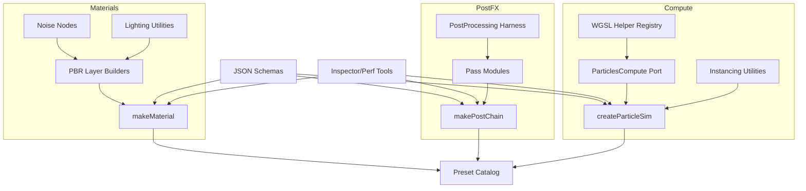

# TSLStudio Implementation Plan v2

## 1. Phase Breakdown (20 Weeks / 5 Phases)
| Phase | Weeks | Focus | Key Outputs |
| --- | --- | --- | --- |
| Phase 1 – Foundation Hardening | 1-4 | Establish repo layout, port core noise/lighting utilities, stand up WebGPU init harness, and baseline QA tooling.【F:DOCS/proposal v1/# 📚 TSLStudio  readme comprewhensive plan.md†L52-L75】【F:DOCS/proposal v1/tsl-toolkit-architecture.md†L5-L63】 | `packages/tsl-kit` skeleton, noise library, lighting nodes, async renderer factory. |
| Phase 2 – Material Stack | 5-8 | Port PBR nodes/presets, integrate lighting, create schema-backed material API, and capture golden renders.【F:DOCS/proposal v1/tsl-toolkit-architecture.md†L24-L107】 | `makeMaterial`, preset bundle (`skin`, `carPaint`, `cloth`), inspector harness. |
| Phase 3 – Post-Processing Suite | 9-12 | Port post-FX nodes/passes, wire `makePostChain`, add performance instrumentation, and build cinematic presets.【F:RESOURCES/REPOSITORIES/portfolio examples/fragments-boilerplate-main/src/tsl/post_processing/post_processing.tsx†L1-L42】【F:RESOURCES/three.js-r181/examples/webgpu_postprocessing_bloom.html†L36-L139】 | Post composer, pass presets (`ACES+Brew`, `FilmGrain`, `Stylized`). |
| Phase 4 – Compute Systems | 13-16 | Port particle/instancing compute kernels, build `createParticleSim`, add WGSL helper registry, and validate performance budgets.【F:RESOURCES/REPOSITORIES/TSLwebgpuExamples/test-webgpu-master/src/test1/ParticlesCompute.js†L1-L93】【F:RESOURCES/three.js-r181/examples/webgpu_compute_particles.html†L31-L189】 | Particle sim API, instancing utilities, compute profiler. |
| Phase 5 – Polish & Agent Enablement | 17-20 | Finalize JSON DSL, presets, documentation, regression tests, and launch-ready demos.【F:DOCS/proposal v1/tsl-toolkit-architecture.md†L76-L151】【F:DOCS/proposal v1/# 📚 TSLStudio  readme comprewhensive plan.md†L78-L199】 | Schema suite, documentation site updates, release candidate. |

## 2. Sprint-by-Sprint (Weekly) Breakdown
Each week assumes 5 focused workdays; adjust for holidays as needed.

### Phase 1 – Foundation Hardening
- **Week 1**
  - Day 1: Scaffold `packages/tsl-kit` per architecture blueprint; add lint/test harness.【F:DOCS/proposal v1/tsl-toolkit-architecture.md†L24-L63】
  - Day 2: Implement async WebGPU init helper for R3F Canvas and smoke-test sample scene.【F:DOCS/proposal v1/tsl-toolkit-architecture.md†L14-L22】
  - Day 3: Port `simplexNoise3d`, `perlin`, and shared `common` helpers into `materials/noise` (retain original math).【F:RESOURCES/REPOSITORIES/portfolio examples/fragments-boilerplate-main/src/tsl/noise/simplex_noise_3d.ts†L1-L58】
  - Day 4: Port additional noise nodes (`simplex4d`, `curl`) from portfolio main; verify TypeScript builds.【F:RESOURCES/REPOSITORIES/portfolio examples/portfolio-main/src/utils/webgpu/nodes/noise/simplexNoise4d.ts†L1-L155】
  - Day 5: Write unit tests comparing sample noise outputs vs. source to guard regressions.
- **Week 2**
  - Day 1: Port lighting utilities (`fresnel`, `hemi`, `diffuse`, `phongSpecular`) into `materials/core`.
  - Day 2: Establish documentation comments and storybook-style demo scene for noise & lighting nodes.【F:RESOURCES/REPOSITORIES/portfolio examples/fragments-boilerplate-main/src/tsl/utils/lighting.ts†L1-L60】
  - Day 3: Migrate inspector scaffolding from Maxime Heckel widgets (static diagrams) for developer docs.【F:RESOURCES/REPOSITORIES/portfolio examples/blog.maximeheckel.com-main/core/components/MDX/Widgets/TSLWebGPU/ParticleCompute.tsx†L1-L68】
  - Day 4: Implement device capability detection + fallback warnings.
  - Day 5: Validate builds, add initial README describing port policy.
- **Week 3**
  - Day 1: Integrate noise nodes into sample `MeshBasicNodeMaterial` to confirm runtime behaviour.
  - Day 2: Start resource inventory matrix inside repo (mirrors table below).【F:DOCS/proposal v1/# 📚 TSLStudio  readme comprewhensive plan.md†L118-L130】
  - Day 3: Build automated screenshot harness for baseline scenes.
  - Day 4: Hook up CLI to run golden comparison.
  - Day 5: Phase review—close feedback, update backlog.
- **Week 4**
  - Buffer for spillover, dependency stabilization, and documentation clean-up.

### Phase 2 – Material Stack
- **Week 5**
  - Day 1: Port `MeshStandardNodeMaterial`-based water/sea preset referencing raging sea example.【F:RESOURCES/three.js-r181/examples/webgpu_tsl_raging_sea.html†L62-L185】
  - Day 2: Port anisotropy/iridescence layers from portfolio main labs.
  - Day 3: Wrap ported layers in `makeMaterial` TypeScript API skeleton.【F:DOCS/proposal v1/tsl-toolkit-architecture.md†L86-L105】
  - Day 4: Define zod schemas for layer parameters.
  - Day 5: Generate unit tests ensuring schema validation rejects out-of-range inputs.
- **Week 6**
  - Day 1: Port skin & cloth presets leveraging lighting utilities.
  - Day 2: Integrate noise textures for breakup (Perlin, FBM) within presets.【F:RESOURCES/REPOSITORIES/portfolio examples/fragments-boilerplate-main/src/tsl/noise/simplex_noise_3d.ts†L1-L58】
  - Day 3: Capture golden renders vs. source references.
  - Day 4: Document preset usage + agent descriptors.
  - Day 5: Review/perf profiling.
- **Week 7**
  - Day 1: Add inspector configuration per preset (controls mirrored from official demos).【F:RESOURCES/three.js-r181/examples/webgpu_tsl_raging_sea.html†L164-L183】
  - Day 2: Implement automated energy conservation test for layered materials.
  - Day 3-4: Buffer for fixes & QA.
  - Day 5: Phase sign-off.
- **Week 8**
  - Contingency & backlog cleanup.

### Phase 3 – Post-Processing Suite
- **Week 9**
  - Day 1: Port `PostProcessing` harness + MRT usage into `post/core`.
  - Day 2: Port stylized effects (LCD, speckled, weave) as modular passes.【F:RESOURCES/REPOSITORIES/portfolio examples/fragments-boilerplate-main/src/tsl/post_processing/lcd_effect.ts†L1-L41】
  - Day 3: Implement `makePostChain` scaffolding with composer lifecycle.【F:RESOURCES/REPOSITORIES/portfolio examples/fragments-boilerplate-main/src/tsl/post_processing/post_processing.tsx†L1-L42】
  - Day 4: Build baseline cinematic chain referencing official bloom sample.【F:RESOURCES/three.js-r181/examples/webgpu_postprocessing_bloom.html†L97-L139】
  - Day 5: Add screenshot regression for each chain.
- **Week 10**
  - Day 1: Port FXAA/film grain/vignette passes.
  - Day 2: Integrate inspector controls for bloom/tonemap parameters.【F:RESOURCES/three.js-r181/examples/webgpu_postprocessing_bloom.html†L115-L143】
  - Day 3: Add GPU timing instrumentation via `util/budget`.
  - Day 4: Author docs & agent schema entries for post passes.
  - Day 5: QA/perf review.
- **Week 11**
  - Day 1: Compose high-end presets (e.g., DOF + SSR hooks) with feature flags.
  - Day 2-4: Stress test on multiple scenes; iterate on fallback behaviour.
  - Day 5: Phase review.
- **Week 12**
  - Contingency.

### Phase 4 – Compute Systems
- **Week 13**
  - Day 1: Port `ParticlesCompute` (init/update/dispose) into `compute/particles` while retaining WGSL functions.【F:RESOURCES/REPOSITORIES/TSLwebgpuExamples/test-webgpu-master/src/test1/ParticlesCompute.js†L1-L93】
  - Day 2: Port instanced particle material from official example for baseline renderer.【F:RESOURCES/three.js-r181/examples/webgpu_compute_particles.html†L31-L189】
  - Day 3: Implement `createParticleSim` API returning compute + render hooks.【F:DOCS/proposal v1/tsl-toolkit-architecture.md†L108-L117】
  - Day 4: Add parameter schema + capability gates.
  - Day 5: Smoke test 200k particle run; log perf budgets.
- **Week 14**
  - Day 1: Port Maxime Heckel instancing demo to `compute/instancing` utilities.【F:RESOURCES/REPOSITORIES/portfolio examples/blog.maximeheckel.com-main/core/components/MDX/Widgets/TSLWebGPU/computeInstance.ts†L61-L142】
  - Day 2: Expose WGSL helper registry (`mat4-compose`, etc.) for reuse.【F:RESOURCES/REPOSITORIES/TSLwebgpuExamples/test-webgpu-master/src/wgsl/mat4-compose.wgsl†L1-L80】
  - Day 3: Build Leva/Tweakpane panel for compute debugging.
  - Day 4-5: Write disposal/perf regression tests.
- **Week 15**
  - Day 1-3: Experiment with fluid/cloth stubs (feature-flag). Evaluate prerequisites.
  - Day 4: Integrate telemetry dashboards into inspector.
  - Day 5: Phase review.
- **Week 16**
  - Contingency.

### Phase 5 – Polish & Agent Enablement
- **Week 17**
  - Day 1-2: Finalize JSON schemas for materials, post, compute; generate TypeScript types.【F:DOCS/proposal v1/tsl-toolkit-architecture.md†L119-L151】
  - Day 3: Build `compileGraph` DSL compiler and validation pipeline.
  - Day 4: Integrate DSL into demo UI for prompt-driven builds.
  - Day 5: Document DSL usage.
- **Week 18**
  - Day 1: Create release-ready presets & metadata (tags, cover images).
  - Day 2: Align docs with resource inventory & porting guide references.【F:DOCS/proposal v1/# 📚 TSLStudio  readme comprewhensive plan.md†L118-L175】
  - Day 3-4: Run full regression suite (visual, perf, schema, memory).
  - Day 5: Triage issues.
- **Week 19**
  - Day 1-2: Conduct pilot integration with internal agent workflows.
  - Day 3: Polish examples, update README, produce walkthrough video script.
  - Day 4: Prepare release notes + changelog.
  - Day 5: Final sign-off review.
- **Week 20**
  - Buffer for release blockers, post-mortem, and backlog grooming.

## 3. Port Mapping Table (Source → Target)
| Source Module | Target Package Location | Notes |
| --- | --- | --- |
| `fragments-boilerplate-main/src/tsl/noise/simplex_noise_3d.ts`【F:RESOURCES/REPOSITORIES/portfolio examples/fragments-boilerplate-main/src/tsl/noise/simplex_noise_3d.ts†L1-L58】 | `packages/tsl-kit/src/materials/noise/simplexNoise3d.ts` | Direct port; maintain helper signatures. |
| `portfolio-main/src/utils/webgpu/nodes/noise/simplexNoise4d.ts`【F:RESOURCES/REPOSITORIES/portfolio examples/portfolio-main/src/utils/webgpu/nodes/noise/simplexNoise4d.ts†L1-L155】 | `packages/tsl-kit/src/materials/noise/simplexNoise4d.ts` | Requires TypeScript typing & tree-shaking adjustments. |
| `fragments-boilerplate-main/src/tsl/utils/lighting.ts`【F:RESOURCES/REPOSITORIES/portfolio examples/fragments-boilerplate-main/src/tsl/utils/lighting.ts†L1-L60】 | `packages/tsl-kit/src/materials/core/lighting.ts` | Expose as named exports for presets. |
| `blog.maximeheckel.com-main/.../computeInstance.ts`【F:RESOURCES/REPOSITORIES/portfolio examples/blog.maximeheckel.com-main/core/components/MDX/Widgets/TSLWebGPU/computeInstance.ts†L1-L195】 | `packages/tsl-kit/src/compute/instancing/maxime.ts` | Extract WGSL kernels + instancing utilities. |
| `test-webgpu-master/src/test1/ParticlesCompute.js`【F:RESOURCES/REPOSITORIES/TSLwebgpuExamples/test-webgpu-master/src/test1/ParticlesCompute.js†L1-L93】 | `packages/tsl-kit/src/compute/particles/base.ts` | Maintain buffer lifecycle + `dispose()` semantics. |
| `fragments-boilerplate-main/src/tsl/post_processing/post_processing.tsx`【F:RESOURCES/REPOSITORIES/portfolio examples/fragments-boilerplate-main/src/tsl/post_processing/post_processing.tsx†L1-L42】 | `packages/tsl-kit/src/post/core/PostComposer.ts` | Adapt to TypeScript and composer API. |
| `fragments-boilerplate-main/src/tsl/post_processing/lcd_effect.ts`【F:RESOURCES/REPOSITORIES/portfolio examples/fragments-boilerplate-main/src/tsl/post_processing/lcd_effect.ts†L1-L41】 | `packages/tsl-kit/src/post/patterns/lcd.ts` | Provide schema metadata + presets. |
| `three.js-r181/examples/webgpu_postprocessing_bloom.html`【F:RESOURCES/three.js-r181/examples/webgpu_postprocessing_bloom.html†L25-L171】 | `packages/tsl-kit/src/post/presets/bloom.ts` | Mirror inspector parameters + wiring. |
| `three.js-r181/examples/webgpu_compute_particles.html`【F:RESOURCES/three.js-r181/examples/webgpu_compute_particles.html†L31-L189】 | `packages/tsl-kit/src/compute/presets/particles.ts` | Use as performance baseline and UI template. |
| `three.js-r181/examples/webgpu_tsl_raging_sea.html`【F:RESOURCES/three.js-r181/examples/webgpu_tsl_raging_sea.html†L62-L183】 | `packages/tsl-kit/src/materials/presets/ragingSea.ts` | Convert to configurable preset with schema. |

## 4. Dependency Graph

Dependencies mirror the architecture blueprint so that utility layers feed APIs which in turn feed presets and agent workflows.【F:DOCS/proposal v1/tsl-toolkit-architecture.md†L24-L151】

## 5. Acceptance Criteria
| Phase | Acceptance Criteria |
| --- | --- |
| Phase 1 | Noise/lighting modules compile and render identically to source; async WebGPU init works across demos; baseline tests and screenshot harness pass. |
| Phase 2 | `makeMaterial` compiles presets without diff >2 ΔE vs. references; schemas reject invalid configs; inspector controls adjust parameters live.【F:RESOURCES/three.js-r181/examples/webgpu_tsl_raging_sea.html†L164-L183】 |
| Phase 3 | `makePostChain` builds chains that match official bloom visuals; timing instrumentation reports per-pass GPU time; all passes expose schema metadata.【F:RESOURCES/three.js-r181/examples/webgpu_postprocessing_bloom.html†L97-L139】 |
| Phase 4 | `createParticleSim` handles 200k particles at ≥60 FPS on baseline hardware; compute buffers dispose cleanly; WGSL helpers reusable across sims.【F:RESOURCES/three.js-r181/examples/webgpu_compute_particles.html†L31-L189】【F:RESOURCES/REPOSITORIES/TSLwebgpuExamples/test-webgpu-master/src/test1/ParticlesCompute.js†L1-L93】 |
| Phase 5 | JSON DSL compiles materials/post/compute graphs end-to-end; documentation updated; release candidate passes full regression matrix.【F:DOCS/proposal v1/tsl-toolkit-architecture.md†L119-L151】 |

## 6. Progress Tracking Checklist
- [ ] Phase 1 complete — core scaffolding, noise, lighting, async init.
- [ ] Phase 2 complete — material API, presets, schemas, renders.
- [ ] Phase 3 complete — post pipeline, passes, perf instrumentation.
- [ ] Phase 4 complete — compute API, particles, instancing, WGSL registry.
- [ ] Phase 5 complete — DSL, docs, release readiness.
- [ ] Visual regression suite passing on CI.
- [ ] Performance budget dashboard populated.
- [ ] Documentation site updated with new guides and reference tables.【F:DOCS/proposal v1/# 📚 TSLStudio  readme comprewhensive plan.md†L118-L199】

