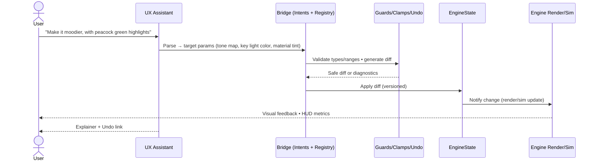
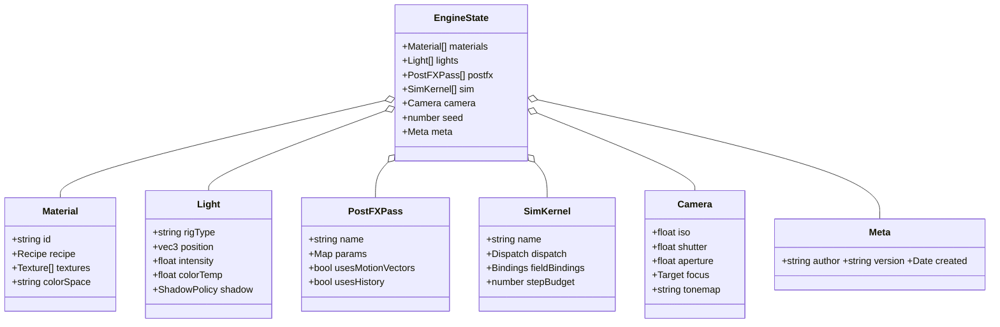
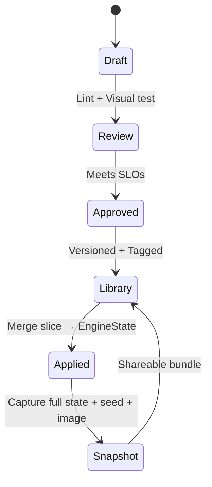
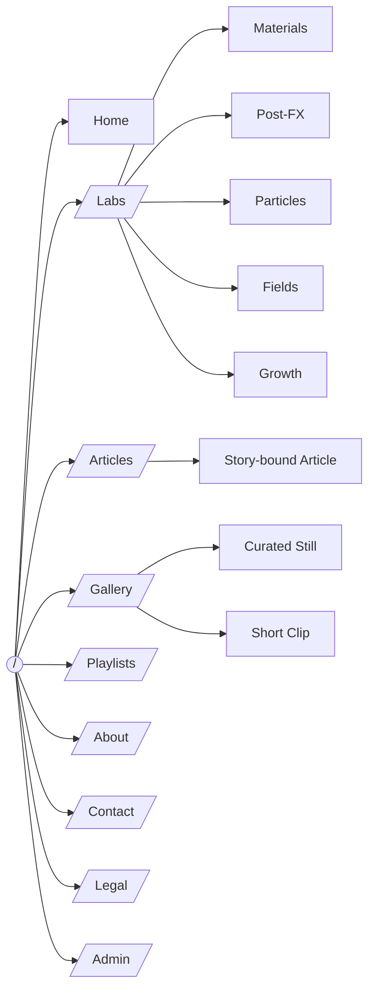
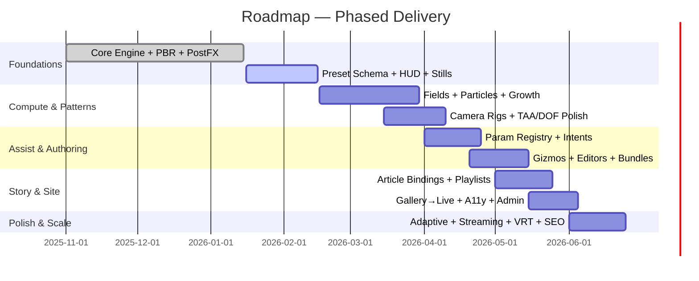
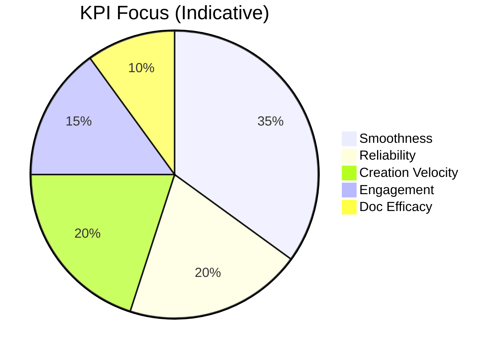

# A Canvas‑First Engine & Website — Visual Blueprint (v3)

> **Purpose:** This is a highly visual, Markdown‑forward edition of the vision. It uses diagrams, structured layouts, and rich formatting to communicate architecture, flows, and priorities at a glance.

---

## Table of Contents
1. Overview at a Glance
2. System Map (Mermaid Architecture)
3. Intent → State Flow (Sequence)
4. Engine State Model (Class Diagram)
5. Presets & Snapshots (Lifecycle)
6. Website IA (Sitemap)
7. Page Anatomy (Wireframe Blocks)
8. Roadmap (Gantt)
9. Quality Bars (Scorecards & Gauges)
10. Risks & Mitigations (Matrix)
11. Parameter Registry (Spec Snippet)
12. North‑Star Demos (Cards)
13. Glossary Chips

---

## 1) Overview at a Glance

- **Engine:** Layered PBR • Post‑FX framegraph • GPU compute (fields/particles/growth) • Physical camera • Deterministic seeds
- **State:** Single source of truth (`EngineState`) • Versioned **Presets** • Full **Snapshots** • A/B compare • Shareable bundles
- **Assistants:** UX Assistant (NL control, safe writes) • Builder Agent (scaffold, docs, PRs)
- **Website:** Canvas‑first pages • Labs • Articles (state‑bound sections) • Gallery (live re‑open) • Playlists • Admin

> **North‑Star:** *Content drives visuals.* Scenes are reproducible, explorable, and easy to share.

---

## 2) System Map (Mermaid Architecture)

```mermaid
flowchart TB
  subgraph Web[Website]
    IA[Routes & IA\nHome • Labs • Articles • Gallery • Playlists • About • Admin]
    Overlay[Content Overlays\n(MDX, Story Bindings, Panels)]
    HUD[HUD/IO\n(Perf, Export, Share)]
  end

  subgraph Interact[Interaction Layer]
    Panels[Parameter Panels]
    Gizmos[Gizmos & Handles]
    Editors[Spline/Field/Mask Editors]
  end

  subgraph Bridge[Assistant Bridge]
    Registry[Typed Param Registry]
    Intents[Intent Map]
    Guards[Guards • Clamps • Undo]
  end

  subgraph Engine[Engine Core]
    Scene[Scene Graph]
    MatGraph[Material/TSL Node Graph]
    Compute[Compute Layer\n(buffers/textures/kernels)]
    PostFX[Post‑FX Framegraph]
    Cam[Physical Camera + Time]
  end

  subgraph State[State & Presets]
    SSOT[EngineState (SSOT)]
    Presets[Presets (versioned slices)]
    Snaps[Snapshots (full state + capture)]
  end

  subgraph IO[I/O & Export]
    Loader[Asset Loader\n(mesh/HDRI/LUT)]
    Export[Stills/Clips/State Bundles]
  end

  subgraph Obs[Observability]
    Perf[Perf HUD & Timings]
    Logs[Event Log]
    Telemetry[Telemetry (opt‑in)]
  end

  IA --> Overlay --> Panels
  Panels -->|param writes| Registry
  Gizmos --> Registry
  Editors --> Registry
  Registry --> Intents
  Intents --> Guards
  Guards --> SSOT
  SSOT <--> Scene
  SSOT <--> MatGraph
  SSOT <--> Compute
  SSOT <--> PostFX
  SSOT <--> Cam
  Loader --> Engine
  Export --> Web
  Perf --> HUD
  Logs --> HUD
  Telemetry --> HUD
```

---

## 3) Intent → State Flow (Sequence)



---

## 4) Engine State Model (Class Diagram)



---

## 5) Presets & Snapshots (Lifecycle)



---

## 6) Website IA (Sitemap)



---

## 7) Page Anatomy (Wireframe Blocks)

```
┌───────────────────────────────────────────────────────────────┐
│ Persistent Canvas (scene morphs across routes)                │
├───────────────┬───────────────────────────────────────────────┤
│ Right Rail    │ Content Overlay (sections bind to state)      │
│ • Perf HUD    │ • Headline • Body • Callouts • Glossary chips │
│ • Camera info │ • Scrollytelling triggers (scroll/voice/click)│
│ • Export      │                                               │
├───────────────┴───────────────────────────────────────────────┤
│ Bottom Dock: Preset bar • History/Undo • Command Palette (/)  │
└───────────────────────────────────────────────────────────────┘
```

---

## 8) Roadmap (Gantt)



> **Note:** Dates are placeholders to visualize sequencing and overlap.

---

## 9) Quality Bars (Scorecards & Gauges)

| SLO | Target | Budget/Notes |
|---|---:|---|
| Frame time | 16.7 ms (60 fps) | Graceful 33.3 ms fallback with adaptive res/LOD |
| Jank spikes | ≤ 8 ms on swaps | TAA restabilize < 500 ms |
| TTI | ≤ 2.5 s | Hydrate presets post‑interactive |
| Stability | < 0.1% hard errors | All failures soft‑fallback |
| A11y | WCAG AA | Full keyboard parity, reduced‑motion |



---

## 10) Risks & Mitigations (Matrix)

| Risk | Impact | Likelihood | Mitigation |
|---|---:|---:|---|
| Temporal instability | High | Med | Strict TAA/velocity; pass ordering |
| Complexity creep | High | Med | Small‑surface API; ADRs; v1 freeze |
| Perf variance | Med | High | Adaptive res/LOD; budgets; fallbacks |
| Assistant miswrites | Med | Med | ACLs; clamps; dry‑run + undo |
| Content drift | Med | Med | Preset linting; visual regression |

---

## 11) Parameter Registry (Spec Snippet)

```json
{
  "lights.key.color": {"type": "color", "space": "srgb", "default": "#b5dfff", "tags": ["mood","key"], "acl": "public"},
  "postfx.tonemap.temperature": {"type": "float", "range": [3000, 12000], "default": 6500, "acl": "public"},
  "materials.coat.anisotropy": {"type": "float", "range": [0, 1], "default": 0.35, "acl": "creator"},
  "sim.particles.stepBudget": {"type": "int", "range": [1, 8], "default": 2, "acl": "creator"}
}
```

---

## 12) North‑Star Demos (Cards)

> **Peacock Alloy** — Anisotropic metal + thin‑film highlights; moody blue‑green grade; cinematic bloom.
>
> **Starry Flow** — Flow‑field growth lines over torso; depth‑aware DOF; rack‑focus on tips.
>
> **Ghost Particles** — Surface‑adhering particles with curl lift; short‑clip export; seed replay.
>
> **Tone‑Mapping 101** — Story that drives exposure/curve presets; interactive focus picker; glossary chips.

---

## 13) Glossary Chips

- **Preset:** Versioned recipe that changes a slice of `EngineState`.
- **Snapshot:** Full scene state + capture; seed included.
- **Field:** Spatial/temporal vector function for forces/advection.
- **Intent:** Natural‑language request mapped to safe parameter diffs.
- **Framegraph:** Ordered render/Post‑FX passes with resource aliasing.

